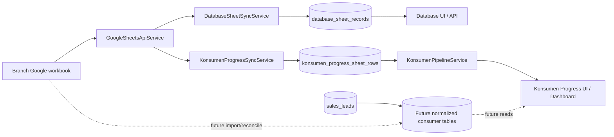
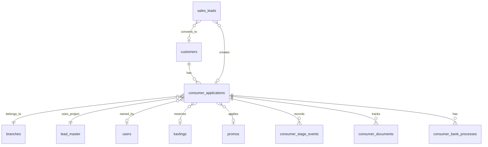

# Database Local Source-of-Truth Migration Plan

Status: **PHASE 4 LOCAL READ FOUNDATION IMPLEMENTED / DEFAULT LEGACY / LOCAL MODE OPT-IN / NO WRITE CUTOVER**
Audit baseline: `cef28361f33aaa532aed289a54b81c1e86f936d4`
Scope: architecture audit, additive Phase 1 schema foundation, Phase 2 manual paste import, and Phase 3 read comparison. No operational read/write cutover or Google retirement is included.

## 1. Executive Summary

OASIS already has a local relational database for identity, branches, projects, kavling, promos, sales leads, expenses, collaboration, and lifecycle records. It does **not** yet have a normalized local consumer/application domain.

Two current modules remain Google-backed mirror systems:

- **Database** imports every tab in a branch workbook into `database_sheet_records`. The UI reads the local cache, while sheet names and edits still depend on Google.
- **Konsumen Progress** imports eight required tabs into `konsumen_progress_sheet_rows`. The pipeline is reconstructed in PHP from JSON rows, using `id_kavling` as its practical join key. A successful refresh replaces the branch snapshot.

Target direction:

```text
local normalized customer/application/process records = canonical operational data
Google Sheets = optional import, export, reconciliation, and legacy bridge
```

Migration must be additive and reversible. Introduce local tables first; backfill and compare before changing reads; then move new writes and dashboard reads behind explicit rollout controls. Keep both current cache tables and Google services until reconciliation, rollback windows, and operational acceptance are complete.

## 2. Current Architecture

### Local canonical or operational records

| Dataset | Current model/table | Current assessment |
|---|---|---|
| Identity | `User`, `users` | Local canonical. Primary role, account lifecycle, branch/project assignments, and reporting fields live locally. |
| Branch | `Branch`, `branches` | Local canonical for branch identity and access. `sheet_id` is an integration pointer, not branch identity. |
| Project | `LeadMaster`, `lead_master` | Local canonical for branch-scoped project identity. The model is named for legacy reasons and is referenced by `project_id`. |
| Kavling | `Kavling`, `kavlings` | Local catalog under `lead_master`; currently only `project_id`, `kavling_code`, and `name`. |
| Promo | `Promo`, `promos` | Local, branch-scoped current configuration. Historical applied terms are not yet modeled. |
| Sales lead | `SalesLead`, `sales_leads` | Local-first canonical lead workflow. Optional lifecycle sync fields and separate history/link tables preserve remote compatibility. |
| Expenses | `Expense`, `expenses` | Local operational records; not part of consumer migration but may reference the same project/branch concepts. |

### Local mirror/cache

| Dataset | Current model/table | Why it is a mirror |
|---|---|---|
| Generic Database | `DatabaseSheetRecord`, `database_sheet_records` | Stores sheet name, row number, headers, arbitrary JSON row, formula columns, metadata, sync state, and soft-delete metadata. `DatabaseSheetSyncService` deletes and rebuilds branch rows after a complete Google response. |
| Konsumen Progress | `KonsumenProgressSheetRow`, `konsumen_progress_sheet_rows` | Stores sheet/tab, row hash, arbitrary JSON row, and sync time. It has no customer/application FK and is replaced branch-wide on successful sync. |
| Sync status | `DatabaseSheetSyncStatus`, `KonsumenProgressSyncStatus` | Operational freshness/error state for each cache, not business truth. |

### Google canonical or hybrid paths

- Branch workbook contents remain the source for Database and Konsumen Progress refreshes.
- Database edits call `DatabaseSheetWriteService`, which writes Google first and updates the local row/cache state. The controller reports failure when no template row or Google response exists.
- `SALES_LEAD_GOOGLE_SYNC_ENABLED` defaults false. Sales leads are local-first where implemented; optional lifecycle push/pull uses explicit branch workbook contracts and stable remote metadata.
- Dana Talangan is outside this migration scope. It remains a separate Google-backed integration with local records/cache and immediate web writes.

## 3. Data Flow Map



### Dataset-by-dataset classification

| Dataset | Model/table | Write source | Read source | Direction / failure | Scope |
|---|---|---|---|---|---|
| Sales Leads | `SalesLead` / `sales_leads` | Local web lifecycle service. Optional Google writer when feature/capability allows. | Local lead queries and monitoring. | Local save should not depend on Google; remote status records failures. | Branch, project, Sales ownership, permissions, and canonical operational Coordinator scope. |
| Database Master consumers/leads | `DatabaseSheetRecord` / `database_sheet_records` | Google sync replaces cache; web edits push Google then update cache. | Local cache for rows; live Google sheet titles are attempted for tabs. | Missing/incomplete Google response leaves previous cache unchanged during sync. UI can use cached sheet names if API unavailable. Edits fail if Google is unavailable. | Branch workbook; `OrganizationScopeService` + `WorkspaceAccessService`; arbitrary sheet/project fields remain JSON. |
| Konsumen Progress | `KonsumenProgressSheetRow` / `konsumen_progress_sheet_rows` | Google sync replaces all rows for selected branch. No local business write route. | Local snapshot through `KonsumenPipelineService`, stage endpoint, Dashboard, AI tools. | Missing/incomplete response leaves previous cache unchanged; successful sync deletes and rebuilds snapshot. Stale/error state is shown. | Branch and required exact-case tabs; pipeline de-duplicates by `branch_id|id_kavling`. |
| Kavling | `Kavling` / `kavlings` | Local administration. Google `data_kav` fallback exists for Dana Talangan options. | Local model in local workflows; some legacy option paths use Google fallback. | Local catalog does not depend on consumer snapshot. | `project_id` → `lead_master` → branch. |
| Promo | `Promo` / `promos` | Local CRUD/import. | Local branch-scoped queries. | No identified Google source in Promo model. | Branch. |
| Branch/project/assignment | `Branch`, `LeadMaster`, `ProjectUser`, `branch_user` | Local admin/services. | Workspace and organization services. | Google `sheet_id` only enables workbook integrations. | Branch/project membership and permissions. |
| Consumer banking/process status | JSON rows in required Progress tabs | Google workbook. | Snapshot + PHP pipeline. | Refresh can replace row identity and values; no durable local history. | Branch; stage determined by tab and `id_kavling`. |
| Dashboard metrics | `DashboardController` | N/A; query aggregation. | Mixed: `DatabaseSheetRecord`, `KonsumenProgressSheetRow`, `SalesLead`, `DanaTalangan`, `ContentItem`, sync statuses. | Freshness depends on cache sync; no unified consumer truth. | Selected accessible branch/project; Superadmin may aggregate. |

## 4. Google Dependency Inventory

`GoogleSheetsApiService` constructs only when `services.google_sheets.credentials_path` exists. Tests replace it with an opt-in Mockery fake through `Tests\TestCase::fakeGoogleSheets()` or explicit bindings. CI must continue without `storage/app/google/service-account.json`.

| Dependency | Type | Current purpose | Classification |
|---|---|---|---|
| `GoogleSheetsApiService` | service | Authenticated Sheets reads/writes, raw/formatted values, tabs, metadata, row formatting, validation helpers. | Integration boundary; credential required only when used. |
| `DatabaseSheetSyncService` | service | Reads every tab/range `A:ZZ`, formulas and metadata; replaces branch cache. | Legacy mirror / optional sync. |
| `DatabaseSheetWriteService` | service | Append/update/delete Google rows and local cache state. | Hybrid legacy write path. |
| `DatabaseController` | controller | Database tabs, cached rows, sync, edit endpoints. | Critical runtime for current Database module; Google-dependent for titles and writes. |
| `SheetCleanupMeta` | command | Removes exact OASIS metadata columns from selected branch sheets. | Admin maintenance tool. Dry-run required. |
| `KonsumenProgressSyncService` | service/command | Reads `data_konsumen`, `bi_checking`, `PSJB`, `pemberkasan`, `proses_bank`, `ppjb_dev`, `akad`, `bast`; replaces branch snapshot. | Legacy mirror / scheduled sync. |
| `KonsumenProgressController` | controller | Snapshot pipeline, sync, sync status, stage JSON. | Critical runtime for current Progress module; reads local cache, sync requires Google. |
| `SyncKonsumenProgress` | command | `konsumen-progress:sync {--branch=}`. | Scheduled/admin sync. |
| `DashboardController` | controller | Lead metrics/activity and progress counts query cache records directly. | Current dashboard dependency. |
| `AiToolRegistry` / `AiAssistantService` | services | Reads Database cache and current Progress pipeline; exposes sync status/actions. | Runtime read integration; must migrate with scope checks. |
| `DanaTalanganGoogleService` / `DanaTalanganOptionService` | services | Canonical Talangan integration and `data_kav` fallback. | Separate module; do not fold into this migration. |
| `SalesLeadSpreadsheetWriter` and lifecycle sync services | services | Optional local-first Sales lead push/pull. | Separate local-first bridge; reuse identity lessons, do not replace here. |

Configured integration values include branch `sheet_id`, `GOOGLE_SHEETS_CREDENTIALS_PATH`, sync timeouts/staleness, `DANA_TALANGAN_SHEET_ID`, and `SALES_LEAD_GOOGLE_SYNC_ENABLED`. Spreadsheet IDs and webhook placeholders in `.env.example` are configuration, not local entity identity; no credential values belong in this plan.

## 5. Database Module Audit

The Database page is a generic spreadsheet browser. It shows branch tabs and rows with dynamic headers, arbitrary JSON values, formula columns, and data-validation metadata. It is not a normalized consumer repository.

`DatabaseSheetRecord` is a **replaceable raw-row mirror/compatibility cache**, not a normalized cache:

- identity is `(branch_id, sheet_name, row_number)` plus optional `oasis_sync_id`;
- `row_number` is inherently unstable when rows move;
- non-OASIS workbooks receive generated UUIDs during sync;
- headers and values remain JSON;
- formulas are tracked as column names, not modeled business calculations;
- `DatabaseSheetSyncService` atomically deletes existing branch cache rows and inserts the new snapshot only after Google responses are complete;
- `DatabaseSheetWriteService` depends on Google for append/update/delete and then updates local status/cache;
- requested branch is checked through organization scope and workspace access; arbitrary project fields are filtered from JSON and are not FK constrained.

Google outage behavior is mixed: cached reads can remain available, tab ordering may fall back to cached names, sync fails without replacing the old cache, and edits cannot complete. This makes the cache useful for continuity but unsuitable as long-term business truth.

## 6. Konsumen Progress Audit

Required exact-case tabs are defined in `KonsumenProgressSyncService::SHEETS`. `data_konsumen` is the customer index; the other seven tabs represent current process stages. `KonsumenPipelineService` maps aliases, finds `id_kavling`, joins stage rows to `data_konsumen`, scans stages in reverse order so the highest stage wins, and returns current-stage items.

Current limitations:

- no customer/application table or FK;
- no durable consumer ID; `id_kavling` is the practical identity and can be absent, reused, or changed;
- `row_hash` includes sheet name and array index, so it is not stable when rows move;
- raw headers and values are JSON and type/validation rules are mostly parsing conventions;
- stage history is inferred from current tab presence and date columns, not stored as events;
- no local edit workflow; Google refresh overwrites the branch snapshot;
- duplicate or conflicting rows are resolved by scan order rather than reconciliation policy;
- missing required tabs fail the sync and preserve the previous snapshot;
- stale status is operational metadata, not a business status.

Current stage taxonomy in source: `bi_checking`, `PSJB`, `pemberkasan`, `proses_bank`, `ppjb_dev`, `akad`, `bast`. `data_konsumen` is source/index data, not itself a displayed stage. Date aliases exist for each stage (`tanggal_*` and `tgl_*`). The source does not currently prove complete domain semantics for booking, DP, utilities, SP3K, building progress, cancellation, or move-kavling; these require field-level workbook inventory before schema commitment.

## 7. Dashboard Dependencies

`DashboardController` currently combines these sources:

| Widget/metric | Current source | Freshness | Migration concern |
|---|---|---|---|
| Recent Lead activity | `DatabaseSheetRecord` rows where `sheet_name=lead`, JSON `tanggal_lead`, `proyek`, `nama_konsumen`, `id_lead` | Last Database sync; cached if Google unavailable. | Must preserve exact lead-day/project/source semantics or label changed KPI. |
| Lead today/month/top source/latest | Same Database `lead` cache | Sync-dependent. | Existing local `SalesLead` fields are more normalized, but historical cache rows may differ from local lifecycle records. Compare before switching. |
| Action queue: new lead | Database `lead` cache | Sync-dependent. | Do not silently change date or source field precedence. |
| Konsumen Progress stage counts | `KonsumenProgressSheetRow` + reverse-stage de-duplication by branch and `id_kavling` | Last Progress sync; stale marker uses Google cache staleness. | Local model must reproduce current-stage precedence and branch filtering before KPI cutover. |
| Sync health/status | `DatabaseSheetSyncStatus` and Progress status | Operational freshness. | Keep until all consumers of legacy sync are removed. |
| Sales weekly/reminders | `SalesWeeklyMetricsService`, `SalesLead` / `ContentItem` | Local current data. | Separate from consumer process migration. |
| Dana Talangan dashboard | `DanaTalangan` local records | Local record freshness, separate Google sync. | Out of scope; do not mix semantics. |

Dashboard migration must use a compatibility adapter and comparison report. Never replace a cache query in the same migration that creates new tables. Baseline counts and sample records must be captured per branch/project and compared over a defined window.

## 8. Target Domain Model

Use existing `Branch`, `LeadMaster` (project), `User`, `Kavling`, `Promo`, and `SalesLead` rather than duplicate concepts.



### Proposed concepts

- **Customer**: stable person identity, deduplicated separately from a housing journey.
- **ConsumerApplication**: one application/journey for a project and branch. A customer may have multiple applications over time; this must be explicit.
- **ConsumerStageEvent**: append-only stage/status transition record with event time, actor/source, reason, and metadata safe for audit.
- **ConsumerDocument**: metadata/status only in first phase; never store document bytes or full sensitive content in the normalized foundation without separate security design.
- **ConsumerBankProcess**: bank/process facts and status history only after workbook field inventory confirms required fields.
- **ConsumerAssignment**: only if the business requires historical assignment snapshots; current Sales visibility should derive from existing project/user assignments and `sales_coordinator_sales`.
- **LegacyIdentity**: stable mapping from imported source identity to local customer/application, separate from row number.

Do not copy `coordinator_user_id` into applications as current authority. Derive current operational visibility through canonical assignment services. Store historical actor/source in event records only when business audit requires it.

## 9. Entity Relationships and Phase 1 Schema Specification

Phase 1 is additive and has no read/write cutover. Exact names remain subject to field inventory review, but the following is implementable without duplicating existing domain entities.

### `customers`

- `id`
- `name` required
- `phone` nullable; `normalized_phone` nullable
- `email` nullable
- `nik_ciphertext` nullable only if a justified encryption design is approved; do not add plaintext NIK by default
- `nik_last4` nullable for masked matching/display
- `kk_ciphertext` nullable only if required by verified source fields
- `address` nullable
- `date_of_birth` nullable only if present and operationally required
- `marital_status` nullable only if present and operationally required
- timestamps, optional `deleted_at` after retention decision

Indexes: `normalized_phone`; carefully reviewed uniqueness only for nonblank values in the production DB; encrypted NIK cannot support ordinary equality lookup without a separate keyed digest. Do not add sensitive fields merely because common CRM schemas contain them.

### `consumer_applications`

- `id`
- `customer_id` FK `customers`, restrict/null policy to be decided before migration
- `branch_id` FK `branches`, restrict on delete
- `project_id` FK `lead_master`, restrict on delete
- `sales_user_id` nullable FK `users`, restrict/null policy aligned with SalesLead
- `kavling_id` nullable FK `kavlings`, null on delete only if historical application remains valid
- `promo_id` nullable FK `promos`, null on delete
- `application_status` string enum-like value, not a giant overloaded status
- `booking_at` nullable
- `akad_at` nullable
- `cancelled_at` nullable
- `created_by`, `updated_by` nullable FKs
- timestamps and soft delete if retention review approves

Indexes: `(branch_id, application_status)`, `(project_id, application_status)`, `(sales_user_id, application_status)`, `kavling_id`, booking/akad dates. Unique constraints require business confirmation; do not assume one application per kavling forever.

### `consumer_stage_events`

- `id`
- `consumer_application_id` FK
- `stage` string from verified canonical stage catalog
- `status` string for stage state, separate from application status
- `occurred_at`
- `completed_at` nullable
- `actor_id` nullable FK `users`
- `source` (`web`, `legacy_import`, `google_sync`, etc.)
- `source_id` nullable
- `reason` nullable
- `metadata` JSON nullable, excluding secrets/full documents
- timestamps

Indexes: `(consumer_application_id, stage, occurred_at)`, `(stage, status, occurred_at)`, source idempotency key. Use an append-only history plus a derived current-state read model later; avoid fixed columns for every evolving stage.

### `consumer_documents`

Phase 1 should track metadata only:

- `id`, `consumer_application_id`, `document_type`, `status`, `received_at`, `verified_at`, `verified_by`, `source`, `notes` (redacted-safe), timestamps.

No file/blob or raw NIK/KK image migration in Phase 1.

### `consumer_bank_processes`

Add only after workbook inventory confirms one application can have a distinct bank process. Proposed minimum: `id`, `consumer_application_id`, `bank_name`, `status`, `submitted_at`, `verified_at`, `sp3k_at`, `rejected_at`, `rejection_reason` (safe text), `source`, timestamps. Do not invent bank fields not present in source.

### `consumer_legacy_identities`

- `id`
- `consumer_application_id` nullable
- `customer_id` nullable
- `legacy_source` (`google_progress`, `database_sheet`, etc.)
- `spreadsheet_id` nullable
- `sheet_name` nullable
- `external_key` nullable
- `legacy_row_number` nullable context only
- `source_payload_hash`
- `first_seen_at`, `last_seen_at`
- `mapping_status` (`mapped`, `candidate`, `invalid`, `unmapped`)
- timestamps

Unique key: `(legacy_source, spreadsheet_id, sheet_name, external_key)` when external key exists. Row number alone is never a durable identity. If source has no stable key, use a reviewed composite candidate and retain ambiguity instead of auto-merging.

## 10. Status and Stage Model

Keep separate axes:

1. **Application status**: lifecycle of the housing application (`draft`, `booked`, `in_process`, `completed`, `cancelled`, `rejected`, `moved`) only after source/business confirmation.
2. **Process stage**: current stage from verified Progress tabs: BI Checking, PSJB, Pemberkasan, Proses Bank, PPJB Dev, Akad, BAST.
3. **Stage status**: pending, in_progress, completed, blocked, rejected, or source-specific values only if proven.
4. **Consumer issue/blocker**: separate issue records or controlled codes; do not overload stage.
5. **Bank status**: bank-specific process state, separate from application status.
6. **Building progress / DP / utility status**: defer until fields and ownership are audited; do not infer them from unrelated sheet columns.

Current source proves stage tabs and date aliases, but does not prove a complete canonical enum for booking, SP3K, build, DP, utilities, cancellation, or move-kavling. Phase 1 must preserve raw source fields in staging/reconciliation, not guess domain semantics.

## 11. Lead Conversion

Current `SalesLead` already has `consumer_converted_at`, `consumer_external_id`, `linked_consumer_reference`, and `SalesLeadConsumerLink`. It is the existing bridge, not a reason to create duplicate customer concepts.

Safe future workflow:

1. Validate SalesLead visibility and conversion permission.
2. Normalize phone and, when explicitly available and authorized, compare a protected NIK digest.
3. Find exact candidates; name-only matches are never automatic.
4. Show candidate customer/application records and require explicit confirmation for a merge/link.
5. Create one Customer if no exact match; create one ConsumerApplication linked to existing branch/project/Sales/Kavling/Promo records.
6. Record `sales_lead_id` link and an ActivityLog/event with actor, source, and reason.
7. Keep remote IDs and legacy references in `consumer_legacy_identities`, not as primary local identity.

Duplicate candidates become reconciliation work, not silent merges.

## 12. Kavling and Promo Integration

`Kavling` is already local and references `LeadMaster` through `project_id`. It currently has no consumer assignment/status columns. Applications should reference `kavling_id`; copied code/name may be retained only as historical snapshot fields after proving names can change.

`Promo` is local and branch-scoped in current migrations/model. The original table had a globally unique name and later added branch scope; migration design must inspect current constraints before adding a FK. An application should reference `promo_id`, but a future immutable applied-promo record or terms snapshot is required if editing/deactivation can change historical contract terms. Do not treat the current Promo row alone as immutable history.

## 13. Authorization

Local consumer routes must reuse existing permission and scope architecture:

- `WorkspaceAccessService`: accessible branches/projects and branch rights;
- `OrganizationScopeService`: module branch/project/team scope;
- `SalesTeamScopeService`: operational Coordinator → Sales membership;
- `ReportingHierarchyService`: managerial/supervisor hierarchy where applicable;
- module permissions and target policies.

Expected visibility, subject to source-backed policy tests:

| Actor | Expected scope |
|---|---|
| Sales | Own consumers/applications within accessible active branch/project assignments. |
| Sales Coordinator | Current operational team through `sales_coordinator_sales`; not generic `users.supervisor_user_id`. |
| Supervisor | Existing canonical supervisor hierarchy/organization scope. |
| Admin Cabang | Authorized branch/workspace scope. |
| Superadmin | Registered permission scope across branches, subject to policy. |

Never duplicate branch/project/rank logic in a new consumer controller. Coordinator scope must use the same service/query as monitoring and evidence authorization to preserve visibility parity.

## 14. Data Sensitivity and Retention

| Field class | Current evidence | Plan |
|---|---|---|
| Name, project, kavling | Names in SalesLead and JSON rows; project/kavling are local. | Normal access scope; audit privileged changes. |
| Phone/email | Phone in SalesLead; JSON consumer rows may contain personal fields. | Normalize for matching; mask in broad UI; avoid logs/exports by default. |
| NIK/KK | `nik` appears in SalesLead SLIK attempt migration; Progress JSON may contain workbook fields. | Inventory exact usage first. No plaintext migration. Prefer keyed digest for exact matching plus encrypted value only if operationally required. |
| Bank/credit/SLIK | SLIK attempts include NIK/result; bank fields remain JSON/source-specific. | Restricted permissions, masked UI, audit reads/changes where required; separate bank process model. |
| Documents | No normalized document entity; evidence storage is a separate Agenda feature. | Phase 1 metadata only; no raw document import. |
| Income/salary | Not established as canonical field in audited models. | Defer until source inventory and purpose confirmed. |

Avoid physical deletion of operational customer/application history. Prefer soft deletes or immutable status transitions; define retention and legal requirements before adding `deleted_at`. Superadmin cleanup/test-data actions must remain separate from normal operational deletes.

## 15. Import, Deduplication, and Reconciliation

Future command design: `php artisan consumers:import-legacy` (planned only). Required options: `--dry-run`, `--branch=`, `--project=`, `--limit=`, `--from-date=`, and `--resume`.

Importer rules:

- read Google/cache through a source adapter, not controllers;
- stage raw rows and mapping diagnostics before creating canonical records;
- use stable OASIS/remote IDs when present;
- use `(spreadsheet_id, tab, external_key)` as idempotency identity;
- treat row number as context only;
- when no stable key exists, use a conservative composite candidate and mark duplicates/ambiguity;
- never overwrite nonempty local canonical fields without explicit conflict policy;
- produce progress, error records, and resumable checkpoints;
- rerunning identical input produces no duplicates.

Reconciliation report per branch/project:

- source row count and local count;
- mapped, unmapped, invalid, duplicate candidates;
- missing branch/project/Sales/Kavling/Promo;
- identity collisions;
- current-stage mismatch;
- date/status mismatch;
- source rows changed since last import;
- records requiring human decision.

Import completion requires an accepted reconciliation report, not only a successful command exit code.

## 16. Rollout Phases

1. **Foundation local schema — IMPLEMENTED** — additive tables, models, relationships, indexes, factories, and tests. No read/write cutover.
2. **Manual paste importer and reconciliation — IMPLEMENTED** — Superadmin-only TSV preview/import into dormant local tables. No Google API dependency, no scheduled import, and no normal operational read/write cutover.
3. **Legacy importer and reconciliation** — staged, idempotent Google/cache import with dry-run and human-review output.
4. **Local read model / compatibility adapter** — read local plus compare legacy; preserve old UI contract.
5. **Konsumen Progress local** — derive current stage from local stage events/read model; keep old sync for comparison.
6. **Dashboard local** — switch one metric group at a time behind controlled fallback; compare KPI definitions and counts.
7. **Local-first writes** — new consumer/application/stage writes local; optional Google bridge after transaction.
8. **Google bridge/export only** — explicit export/reconciliation, no Google authority for local records.
9. **Legacy mirror retirement** — only after retention, audit, reconciliation, rollback, and operational acceptance windows close.

Recommended flags only when a phase is implemented: `CONSUMER_LOCAL_READ_ENABLED`, `CONSUMER_LOCAL_WRITE_ENABLED`, `CONSUMER_LEGACY_COMPARE_ENABLED`. Do not add flags before their rollout semantics exist.

## 17. Rollback Plan

- **Schema foundation:** stop new local use; old reads continue because legacy tables/services remain.
- **Importer:** disable command/schedule; retain staged mappings and source snapshots; no destructive delete.
- **Compatibility read:** revert adapter/flag to legacy cache; preserve comparison logs.
- **Dashboard switch:** turn off local read flag and verify legacy sync freshness; do not drop old tables.
- **Local writes:** stop local writes or bridge, keep existing local records; reconcile unsent changes before retry.
- **Google retirement:** no rollback after deleting legacy data until verified backup, export, retention, and recovery acceptance are complete. Do not drop mirror tables in the same release as read cutover.

Every production phase needs database backup verification, migration rollback decision, owner, and explicit go/no-go evidence.

## 18. Testing Strategy

### Unit

- row/header mapping and type normalization;
- stable identity selection and idempotent import;
- duplicate candidate classification;
- stage precedence and date conversion;
- status transition invariants;
- protected sensitive-field matching/masking.

### Feature

- create/update application and stages;
- Sales own scope;
- Coordinator `sales_coordinator_sales` scope;
- Supervisor hierarchy scope;
- Admin branch scope;
- denied branch/project/assignment;
- Lead conversion with exact match, no match, duplicate candidate, and explicit merge;
- Kavling/Promo FK and historical snapshot behavior;
- audit events and soft-delete policy.

### Migration/regression

- dry-run does not mutate canonical data;
- import twice produces no duplicates;
- invalid/missing project/Sales/Kavling rows reconcile safely;
- partial failure resumes;
- legacy vs local counts/statuses report differences;
- Dashboard KPI parity;
- Sales Fee/admin monitoring parity;
- Google unavailable behavior remains safe;
- tests require no Google credential.

CI gates remain PHP/Laravel, changed-file Pint, Composer audit, npm build, and npm audit. No Google secrets or fake service-account file may be added.

## 19. Risks and Open Decisions

1. **No stable source identity:** `id_kavling` and row position are insufficient. Workbook identity fields must be inventoried before automatic import.
2. **Kavling reuse/movement:** an application cannot use current kavling code as its only identity; historical assignment needs events/snapshots.
3. **Unknown workbook schema:** booking, DP, utilities, SP3K, building, and cancellation semantics are not proven by current PHP code.
4. **Sensitive data exposure:** JSON rows may contain more PII than model inventory shows. Inspect actual headers under controlled access before import.
5. **Promo history:** current Promo rows are mutable/deactivatable; applied terms need immutable history.
6. **Dashboard drift:** current-stage de-duplication is code behavior, not a stored invariant. Baseline and parity tests are mandatory.
7. **Scope regression:** generic organization hierarchy must not replace canonical Coordinator operational membership.
8. **Google write divergence:** local-first writes need outbox/retry/conflict policy before disabling Google writes.
9. **Retention/legal requirements:** customer, bank, and document retention needs product/legal decision before deletion/encryption design.
10. **Performance:** JSON cache scans currently hide query requirements; use real Dashboard/report query plans to validate indexes.

Open decisions before Phase 1 migration:

- authoritative source workbook/version and field inventory per branch;
- stable external IDs and branch-scoped identity contract;
- exact application status catalog and stage-state catalog;
- required sensitive fields and encryption/keyed lookup design;
- Promo historical contract requirements;
- one-vs-many application and kavling rules;
- retention/soft-delete policy;
- fallback/feature-flag owner and reconciliation acceptance threshold.

## 20. Recommended Implementation Order

1. Freeze and document source contracts per required tab; inventory real headers and field types without changing production behavior.
2. Approve identity/deduplication and sensitive-field policy.
3. Implement additive Phase 1 schema/models/relationships/policies and isolated tests.
4. Build staging importer with dry-run, stable legacy identity, resumability, and reconciliation output.
5. Backfill one representative branch; compare counts, identities, stages, and Dashboard KPIs.
6. Add compatibility adapter and dual-read comparison before any user-facing read switch.
7. Migrate Konsumen Progress read model and Dashboard metrics incrementally.
8. Implement local-first writes and optional Google bridge/outbox.
9. Retire mirror paths only after rollback window and operational sign-off.

**Phase 2 manual paste implemented.** This change adds only a Superadmin-only TSV migration tool writing dormant local tables. It does not change normal reads/writes, Dashboard, Konsumen Progress behavior, Google sync, or scheduled imports.

**Phase 3 read comparison implemented.** `ConsumerReadComparisonService` compares the cached legacy Konsumen Progress snapshot with existing local consumer/application tables for an explicitly selected branch and project. The diagnostic page is Superadmin-only, read-only, uses stable legacy identity mappings first, reports coverage and field differences, and does not change any operational source of truth. No operational read cutover, normal write cutover, schema migration, Google behavior, Dashboard behavior, Database behavior, or Konsumen Progress behavior is included.

Phase 3 compares identity, normalized phone, branch/project context, Sales, Kavling, canonical stage, booking date, Akad date, bank, and bank status. Legacy application status is excluded because the current snapshot does not prove equivalent semantics. Raw spreadsheet fields, sensitive identifiers, documents, financial values, and inferred business states are excluded. Legacy rows without a shared stable identity remain unmatched rather than being matched by name. Latest bank process is selected by submitted date, then updated date; ties follow existing row order.

## Audit References

Primary source inspected: `app/Models`, `app/Services`, `app/Http/Controllers/Crm`, `app/Console/Commands`, `routes/web.php`, `routes/console.php`, `config/services.php`, `config/oasis_modules.php`, relevant migrations, `tests/TestCase.php`, Database/Konsumen/Dashboard/AI tests, `README.md`, and `docs/DEVELOPER_HANDOFF.md`.

Relevant current code anchors include:

- `app/Models/DatabaseSheetRecord.php`
- `app/Models/KonsumenProgressSheetRow.php`
- `app/Services/DatabaseSheetSyncService.php`
- `app/Services/DatabaseSheetWriteService.php`
- `app/Services/KonsumenProgressSyncService.php`
- `app/Services/KonsumenPipelineService.php`
- `app/Services/GoogleSheetsApiService.php`
- `app/Http/Controllers/Crm/DatabaseController.php`
- `app/Http/Controllers/Crm/KonsumenProgressController.php`
- `app/Http/Controllers/Crm/DashboardController.php`
- `database/migrations/2026_07_03_010000_create_database_sheet_cache_tables.php`
- `database/migrations/2026_07_03_000000_create_konsumen_progress_cache_tables.php`
- `database/migrations/2026_07_27_000002_create_sales_leads_table.php`
- `database/migrations/2026_08_03_000005_create_sales_lead_lifecycle_tables.php`
- `database/migrations/2026_06_19_072000_create_kavlings_table.php`
- `database/migrations/2026_08_10_000007_create_promos_table.php`

Phase 1 executable foundation is implemented in additive migrations, models, factories, and focused tests; no runtime read/write path was changed.

**Phase 4 local read foundation implemented.** Konsumen Progress now has one read adapter with `legacy` as default and explicit `CONSUMER_PROGRESS_READ_SOURCE=local` opt-in. Local reads use eager-loaded normalized application data, canonical stages, and deterministic latest-bank selection. Local read failure falls back to legacy with sanitized branch-scoped warning logging. Empty local results remain empty in local mode. No write cutover, Dashboard cutover, Database cutover, Google retirement, or new schema migration is included.
